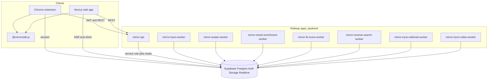

# Mirror

Social virtual try-on for real shopping: a **Chrome extension** (side panel) and a small **Next.js** web companion, plus **FastAPI** on Railway and **Supabase** (Postgres, Auth, Storage, Realtime).

## Why this exists

Most people do not buy a jacket because the packshot is perfect. They buy because they saw it on someone. Influencers and celebrities normalize a cut or a brand. Screenshots and “where did she get that” threads are the funnel; storefronts still behave like catalogs. Mirror puts **two proofs** next to each other on the product page: **real people wearing the item or something like it** (our **Worn by** strip from Mirror posts and the wider web), and **virtual try-on on your body** from reference photos you approve in the web app first. Add **fit score** against what you already own, optional **editorial** stills you can share, and **Feed** / **Circle** so people you trust can react before you pay.

## What we ship in this repo

| Surface | Role |
|--------|------|
| Extension | Shop any PDP: Worn by, try-on, editorial (when enabled), fit score, feed, circle |
| Web app | Sign-in, biometric consent, reference uploads, closet, feed, settings |
| Backend | FastAPI API plus workers for try-on, reverse search, fit score, editorial, video, etc. |

## Stack

One session across clients: **Supabase** for identity and data, **FastAPI** on Railway for HTTP, **job queues and workers** for anything slow, extension and web in **TypeScript**, backend in **Python**.

**Social proof and self proof answer different questions.** “She wore it” lowers fear of regret; “it looks like this on me” lowers fit risk. The product wires both onto the PDP.

**Challenges in practice:** worn-image discovery is noisy (rights, duplicates, slow third-party search). We filter, cache, and fail soft. Reference photos and consent are strict by design.

## Architecture

Clients talk to **Supabase** (auth, Postgres, storage, realtime) with the anon key and JWT. They call **`mirror-api`** over HTTPS for orchestration (try-on submit, reverse search, fit score, closet saves, etc.). Slow work is written as rows in Postgres; **workers** poll or subscribe and call external APIs (try-on provider, Gemini, SerpAPI, Apify, etc.). Production web is commonly on **Vercel**; API and workers on **Railway** (same Docker image from `apps/backend`, different start commands).

Worker entry points live in [`apps/backend/pyproject.toml`](apps/backend/pyproject.toml) under `[project.scripts]`. Railway **config-as-code** examples: [`apps/backend/railway.toml`](apps/backend/railway.toml) (API), [`railway.tryon-worker.toml`](apps/backend/railway.tryon-worker.toml), [`railway.avatar-worker.toml`](apps/backend/railway.avatar-worker.toml), [`railway.reverse-search-worker.toml`](apps/backend/railway.reverse-search-worker.toml), [`railway.tryon-editorial-worker.toml`](apps/backend/railway.tryon-editorial-worker.toml), [`railway.tryon-video-worker.toml`](apps/backend/railway.tryon-video-worker.toml). Fit-score and closet-enrichment workers use the same image; set start command in the dashboard to `mirror-fit-score-worker` / `mirror-closet-enrichment-worker` if you split them out.

Full stack detail: [docs/02_Technical_Architecture.md](docs/02_Technical_Architecture.md).

## Repo layout

| Path | Description |
|------|-------------|
| `apps/web` | Next.js 14 App Router |
| `apps/extension-wxt` | Chrome MV3 extension (WXT + React) |
| `apps/backend` | FastAPI + workers (`uv`) |
| `packages/sdk-js` | Shared TypeScript client helpers |
| `supabase/` | Migrations, seed, local config |
| `docs/` | Product and technical documentation |

More detail: [docs/00_README.md](docs/00_README.md). Extension overview: [apps/extension-wxt/README.md](apps/extension-wxt/README.md). End-user extension flow: [apps/extension-wxt/OVERVIEW.md](apps/extension-wxt/OVERVIEW.md).

## Prerequisites

- Node 20+, [pnpm](https://pnpm.io/) 9
- Python 3.12 + [uv](https://github.com/astral-sh/uv)
- [Supabase CLI](https://supabase.com/docs/guides/cli) for local DB

## Quick start

1. Copy env templates in each app (see `apps/*/.env.example` when present) and set Supabase URL/keys.
2. **Database:** hosted — from repo root `supabase login`, `supabase link --project-ref <id>`, `supabase db push` (see [docs/E2E_SMOKE.md](docs/E2E_SMOKE.md) §1). Local only — `supabase start` then `supabase db reset`. IDE Supabase plugins do not replace `db push` for repo migrations.
3. `pnpm install` then `pnpm dev:web` or `pnpm dev:extension`.
4. Backend: `cd apps/backend && uv sync && uv run mirror-api` (see `apps/backend/README.md`).

Deploy and ops: [docs/06_Deployment_Operations.md](docs/06_Deployment_Operations.md).

Smoke checklist: [docs/E2E_SMOKE.md](docs/E2E_SMOKE.md). Demo friend seeding: [docs/DEMO_SEED.md](docs/DEMO_SEED.md) and [scripts/seed-demo-friends.sql](scripts/seed-demo-friends.sql).

## Demo friends (H12)

Follow [docs/DEMO_SEED.md](docs/DEMO_SEED.md). Track completion in [docs/05_Implementation_Plan.md](docs/05_Implementation_Plan.md) section 2.2a.
