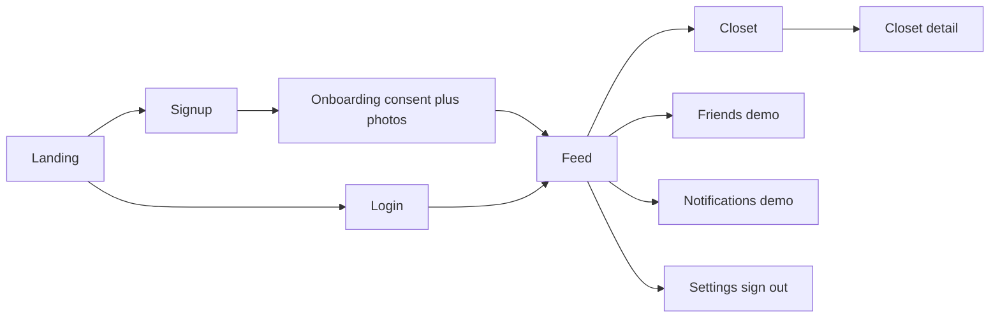

# Using Mirror on the web

Short guide for **people using** the Mirror website—not engineers.

## In one sentence

Mirror on the web is a signed-in companion where you set up a one-time full-body reference photo (with clear consent), then browse a social feed of people’s virtual try-on posts, save and review clothes in your personal closet, and use placeholder-style friends, notifications, and account tools while the full social graph ships later.

(This matches the pitch on the landing page: virtual try-on on your body plus social proof from people you trust.)

## User flow in actual order

This follows how routes work in the web app today—not the Chrome extension.

1. **Landing (`/`)** — Short pitch and buttons: **Sign in**, **Create account**, or **Feed**. If you tap **Feed** without being signed in, you are asked to **sign in first**.

2. **Create account (`/signup`)** — Enter email and password; after signup you go to onboarding.

3. **First-time setup (`/onboarding`)** — **Step 1:** agree to biometric/reference-photo consent. **Step 2:** upload one to five full-body photos (each image must meet a minimum size). When upload succeeds, you land on **Feed**.

4. **Sign in (`/login`)** — Email and password; on success you go straight to **Feed**. (Brand-new accounts usually hit onboarding right after signup; signing in later skips that screen.)

5. **Main app** — After sign-in you see the sidebar: **Feed**, **Closet**, **Friends**, **Notifications**, **Settings**, plus your account chip. Any of these pages requires you to stay signed in.

6. **Feed (`/feed`)** — Scroll a grid of **posts** (try-on images with captions). You can **react** (for example “Fire”); reaction counts can update live. The composer at the top is a **placeholder** for now—new posts often come from try-on and share flows elsewhere (for example the extension).

7. **Closet (`/closet`)** — **My Closet** shows your try-on results; **Saved** is your wishlist; **Owned** is for items you mark as already yours. You can search, filter (for example tops vs bottoms), and open a **card** for more detail.

8. **Closet item (`/closet/.../...`)** — Open one saved or tried item to see it larger, with more detail; you can remove or manage the item from here, depending on the screen.

9. **Friends (`/friends`)** — **Demonstration** layout with sample people and tabs. The real friend graph is not fully wired here yet.

10. **Notifications (`/notifications`)** — **Demo** list with unread-style treatment. Treat it as a preview, not full product notifications on the web yet.

11. **Settings (`/settings`)** — Profile and account options, some toggles, and **Sign out**.

## Notes

- **Where try-on is “created”** in this repo: the **browser extension** is the main place to run try-on on a product while you shop. The **website** is the companion for **account**, **reference photo setup**, **feed**, and **closet**—in line with the “companion app” role in the product docs.
- Anything described as **demo** or **placeholder** is intentionally early: friend lists, the notifications list, and the feed composer are not the full finished social product yet.
